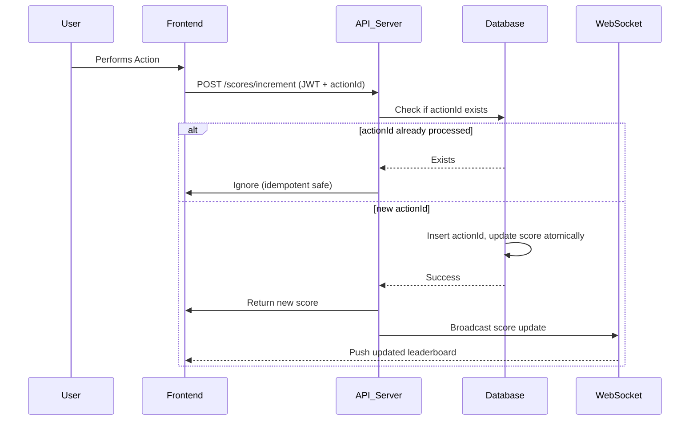

# Scoreboard API Module

This module provides APIs and real-time updates for a live scoreboard system.  
It manages user scores, updates them upon user actions, and ensures secure and consistent operations.

---

## Features
- Fetch **Top 10 users** by score.
- Update a user’s score when an action is completed.
- **Real-time scoreboard updates** via WebSocket/SSE.
- Security measures against unauthorized or duplicate score manipulation.
- Idempotency and atomic operations to avoid race conditions.

---

## API Endpoints

### 1. Get Top Scores
**Endpoint:** `GET /scores/top`  
**Description:** Returns the top 10 users sorted by score.  

**Response Example:**
```json
{
  "scores": [
    { "userId": 1, "username": "Alice", "score": 125 },
    { "userId": 2, "username": "Bob", "score": 119 }
  ]
}
```

---

### 2. Increment User Score
**Endpoint:** `POST /scores/increment`  
**Authentication:** Required (JWT Bearer Token).  
**Description:** Increments the authenticated user’s score by 1.  

**Request Example:**
```http
POST /scores/increment
Authorization: Bearer <jwt_token>
Content-Type: application/json
{
  "actionId": "550e8400-e29b-41d4-a716-446655440000"
}
```

**Response Example:**
```json
{
  "success": true,
  "newScore": 126
}
```

- `actionId` is a UUID used to prevent replay of the same action (idempotency key).

---

## Real-Time Updates

- **Channel:** `ws://<server>/scores/stream` (WebSocket)  
- Clients subscribe to this endpoint.  
- Whenever a score is updated, all subscribers receive an event:

```json
{
  "event": "scoreUpdated",
  "userId": 1,
  "newScore": 126
}
```

---

## Database Schema

### Users Table
```sql
CREATE TABLE users (
    id SERIAL PRIMARY KEY,
    username VARCHAR(255) NOT NULL UNIQUE,
    score INT DEFAULT 0,
    created_at TIMESTAMP DEFAULT NOW(),
    updated_at TIMESTAMP DEFAULT NOW()
);
```

### Score Actions Table (Idempotency Tracking)
```sql
CREATE TABLE score_actions (
    id UUID PRIMARY KEY,             -- actionId
    user_id INT NOT NULL REFERENCES users(id),
    processed_at TIMESTAMP DEFAULT NOW()
);
```

- Before incrementing a score, the API checks if the `actionId` exists.  
- If already processed → request is ignored.  
- If new → insert record + increment score in one transaction.

---

## Execution Flow Diagram



---

## Security & Data Integrity

To prevent malicious score updates and ensure correctness:

1. **Authentication & Authorization**
   - All update requests must include a valid JWT token.
   - Only authenticated users can increment their score.

2. **Idempotency**
   - Each request must include a unique `actionId` (UUID).
   - Server checks if the `actionId` has already been processed:
     - If yes → request is ignored (no double counting).
     - If no → process score increment and log the action.

3. **Atomic Updates**
   - Score increments use atomic SQL updates (`score = score + 1`) or row-level locks.
   - Ensures consistency under parallel or multi-threaded requests.

4. **SQL Injection Prevention**
   - All DB queries use parameterized statements or ORM methods.
   - No raw string concatenation from client input.

5. **Rate Limiting**
   - Enforce per-user request throttling (e.g., max 1 increment/second).
   - Prevents spamming of valid but excessive requests.

6. **Audit Logging**
   - Each increment request logged with `userId`, `actionId`, and timestamp.
   - Helps detect abnormal patterns or fraudulent activity.

---

## Suggested Improvements
- **Caching:** Use Redis to cache top 10 scores for faster reads.
- **Scalability:** Use Pub/Sub (Redis, Kafka) to broadcast updates across multiple API instances.
- **Replay Protection:** Validate `actionId` against a business rule (not just uniqueness).
- **Monitoring & Alerts:** Detect abnormal increments (fraud detection).
- **Data Expiry:** Optionally purge old `score_actions` entries for performance.

---